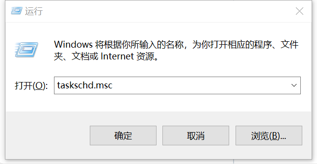
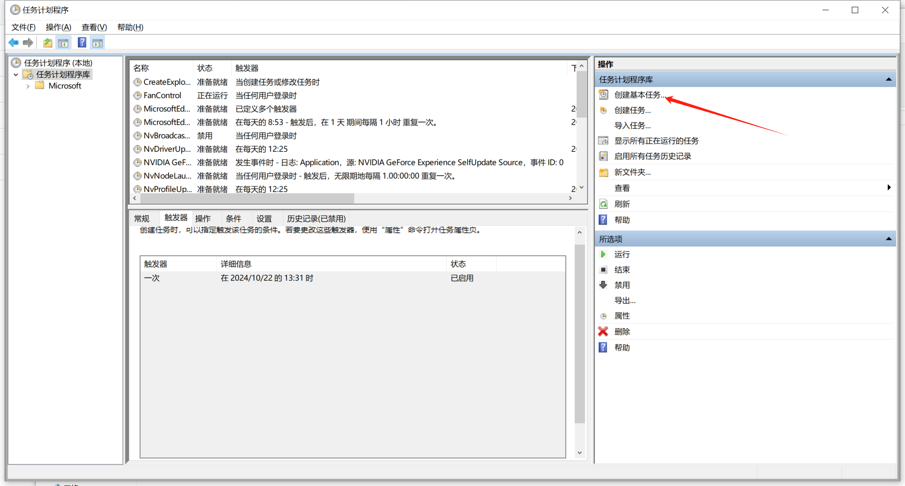
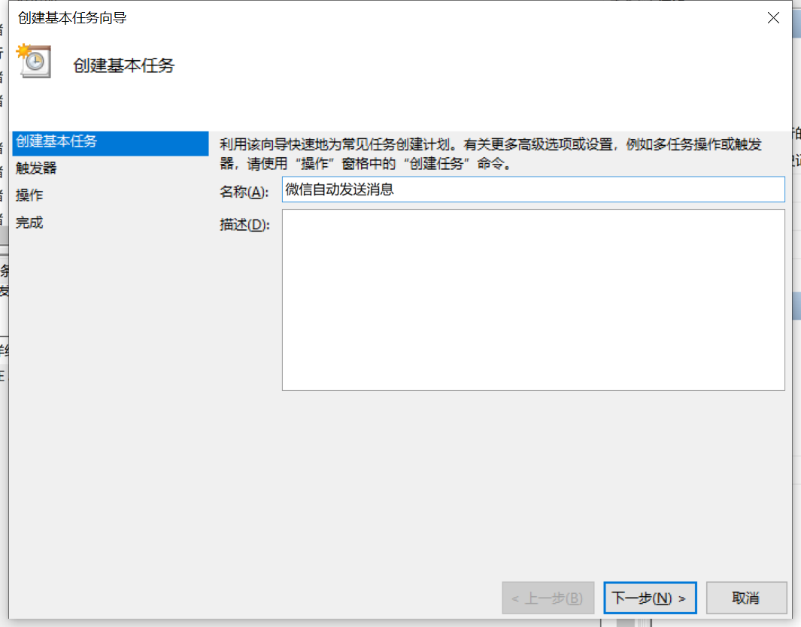
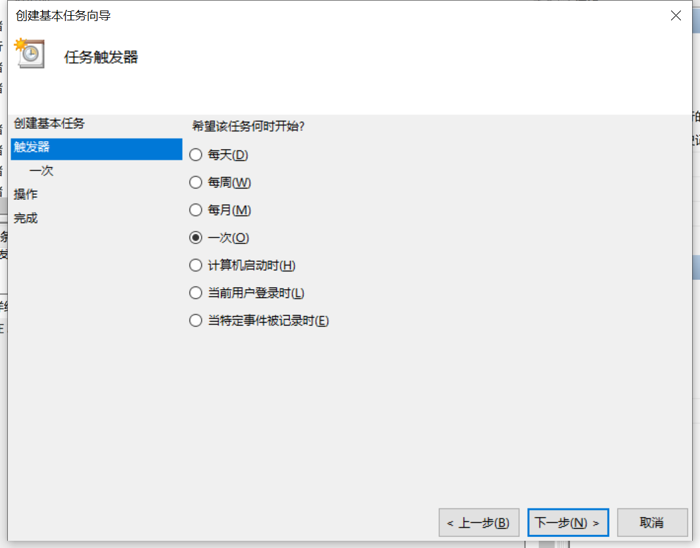
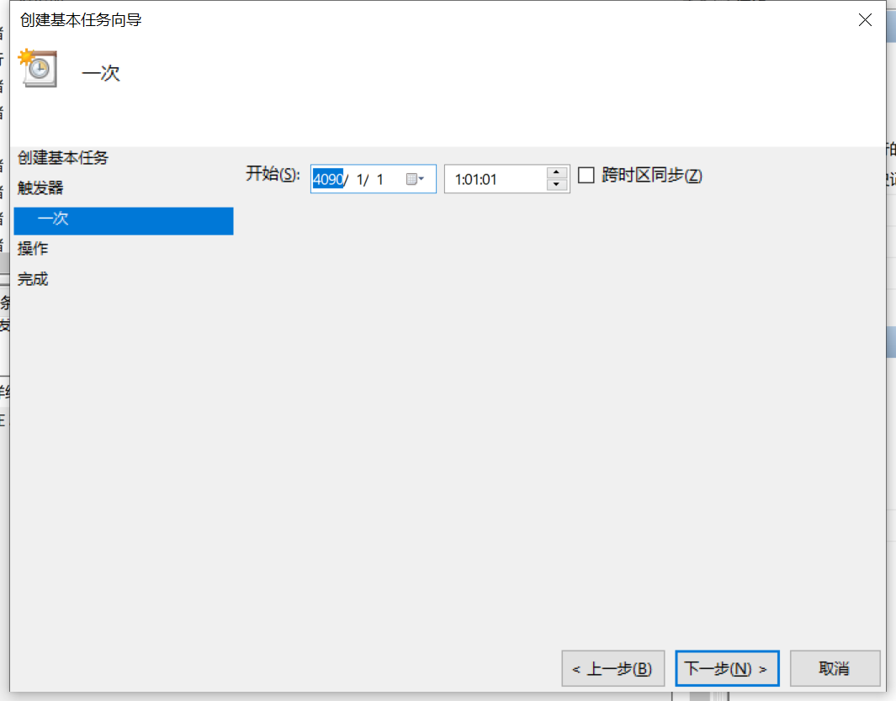
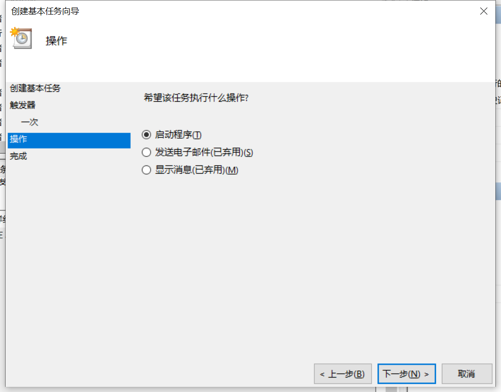
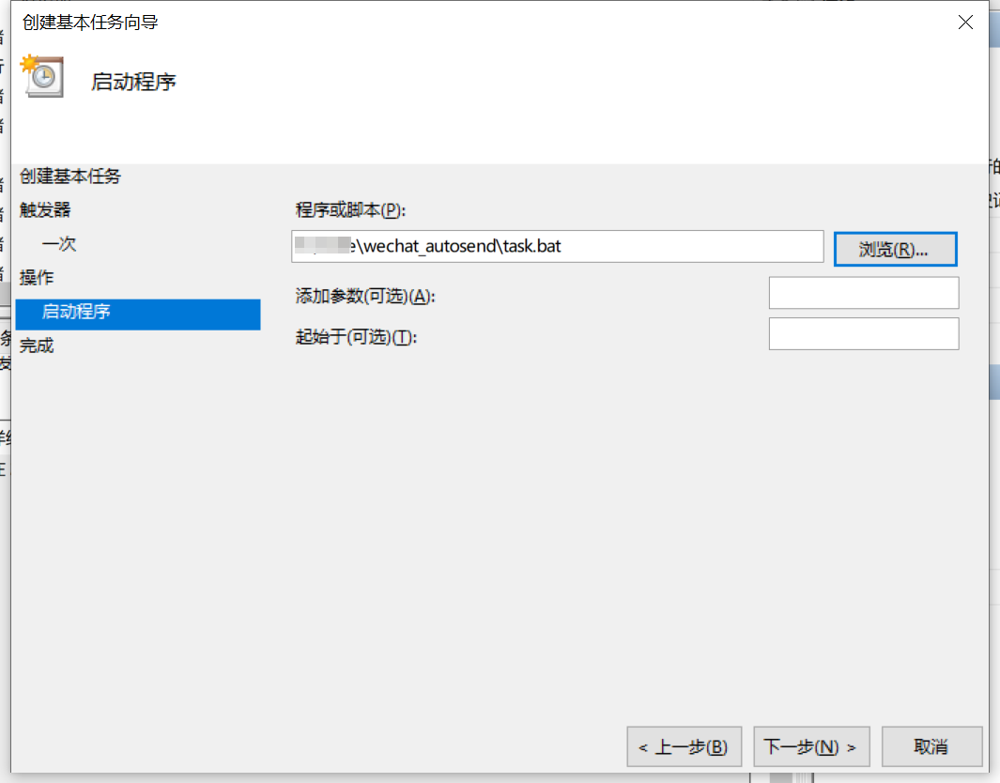
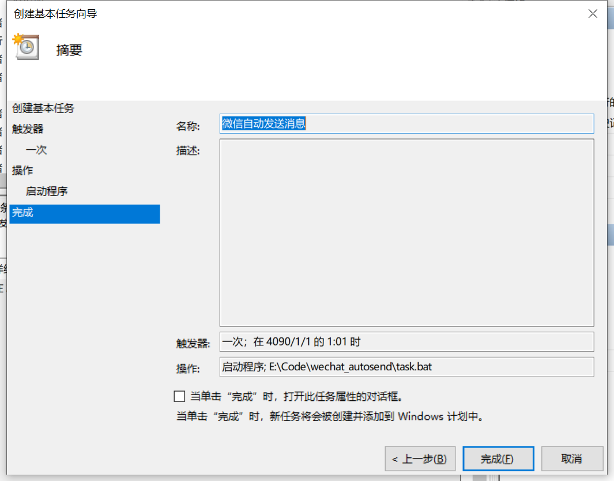
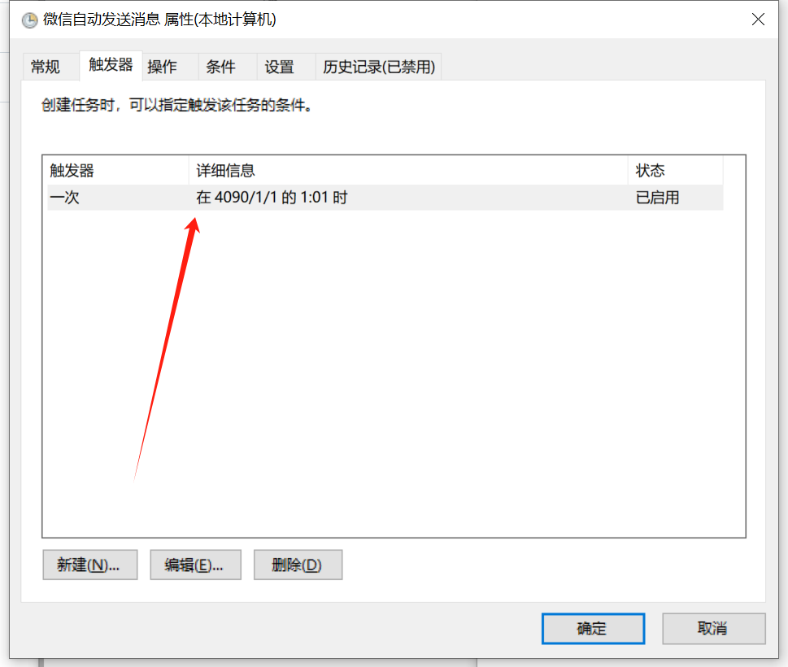

自用的微信定时发送消息脚本


## 使用方法

依赖：

```
pip install pywinauto
```


先win+R，输入cmd进入命令行

```
python --version
```

观察是否有输出，确定电脑已安装好python，该脚本在3.6和3.10版本测试过能正常运行。

cd进入autosend.py所在文件夹，运行

```
python .\autosend.py
```


在main函数中修改

```python
    wechat_path = r'D:\Tencent\WeChat\WeChat.exe'   #设置微信路径
    chat_title = "文件传输助手"  # 设置聊天框标题
    message = "测试自动发送代码"  # 设置要发送的消息
```

编辑task.bat文件，修改路径

```
python E:\Your\Path_to_codefile\autosend.py
```


## 定时启动

1、按下win+R



2、创建基本任务



3、填写名称和描述



4、选择触发类型和开始时间





5、选择启动程序



6、选择脚本程序



7、最后选择完成



后续需要重复利用可以双击该任务计划，更换触发器条件


